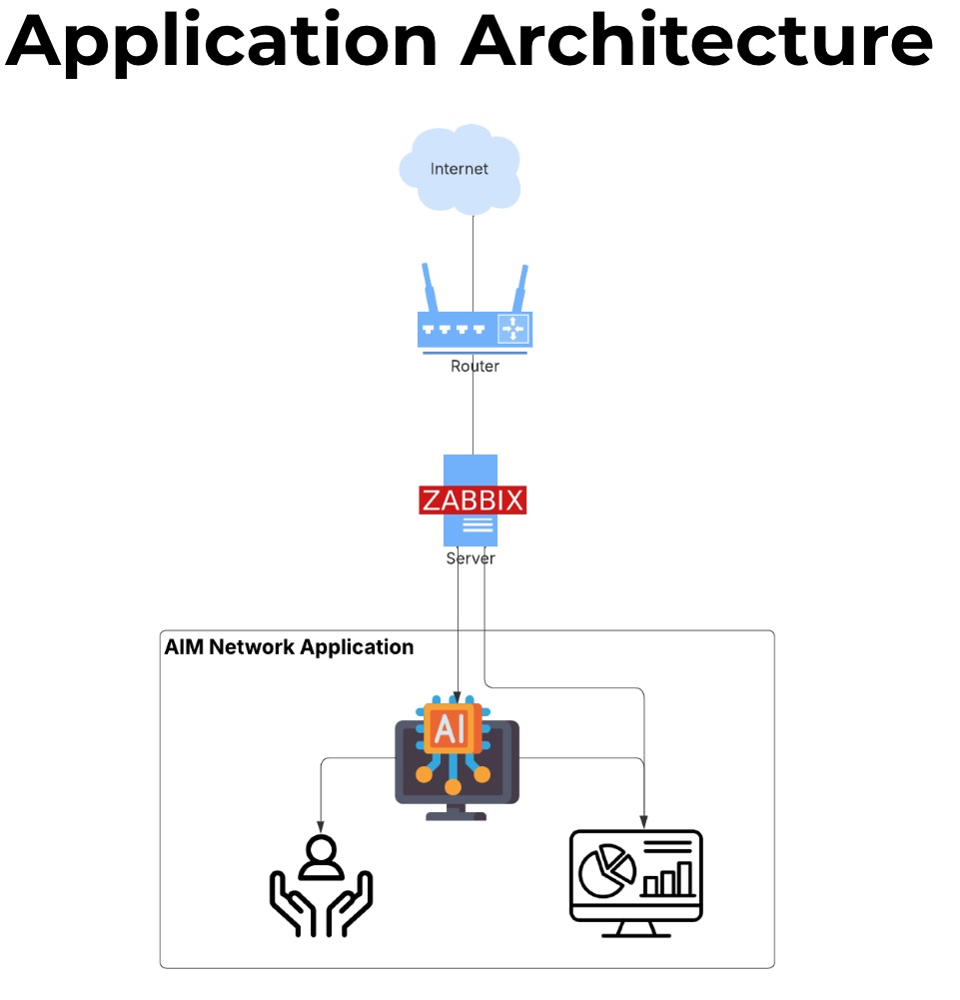

# 🚀 AI Drive Mesh Network - AI for connectivity hackathon


Welcome to the AIM Network AI Hackathon project! This application is designed to showcase innovative AI solutions developed during the hackathon. Our goal is to leverage AI technologies to solve real-world problems and enhance user experiences.

## Table of Contents

- [Features](#features)
- [Technologies Used](#technologies-used)
- [Installation](#installation)
- [Usage](#usage)
- [Contributing](#contributing)
- [License](#license)

## 🌟 Features

- **User-Friendly Interface**: Intuitive design for easy navigation.
- **Real-Time AI Processing**: Leverage AI algorithms for instant results.
- **Scalable Architecture**: Built to handle a growing number of users and data.
- **Cross-Platform Compatibility**: Accessible on various devices and platforms.

## 🛠️ Technologies Used

- **Frontend**: Streamlit, CSS
- **Backend**: Python, JS
- **Database**: mySQL
- **AI Frameworks**: LangGraph, Groq, LLAMA
- **Deployment**: Replit
- 
## 🎯 How It Works
1. **Fetch Network Logs:** Real-time network streaming using Zabbix Agent.
2. **Realtime Monitoring:** Zabbix dashboarding and monitoring. API integration with Zabbix
3. **Instant Troubleshooting:** Alert forwarding to LLM via Groq API.
4. **AI Resolution:** RAG AI Chatbot to solve network issues related to the organization.

## 📡 Live Demo
[Live Demo of AIM Network Application](https://aim-network-ai-hackathon.replit.app/)


[Live Demo of AI Powered Zabbix Server](http://98.62.234.66/zabbix/zabbix.php?action=dashboard.view&dashboardid=1)

**Note** : When you click on the Zabbix server link it will ask for username and password. Please find below.

**Username**: AIM_Network

**Password**: Hackathon123



## Installation

To run this application locally, follow these steps:

1. Clone the repository:
   ```bash
   git clone https://github.com/yourusername/aim-network-ai-hackathon.git
## Setup Instructions

1. Create and activate a virtual environment:
   ```bash
   python3 -m venv .venv
   source .venv/bin/activate

2. Install all the required libraries
```bash
pip install -r requirements.txt
```

3. Create an .env file and setup the Groq API key in the .evn file:
```bash
cp .env_template .env
```

4. Run the application with the command:
```bash
streamlit run main.py
```
